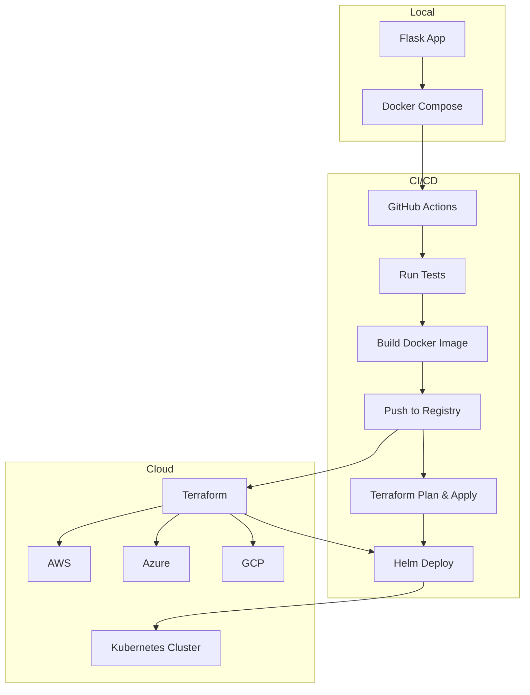

# Multi-Cloud CICD Pipeline

[](https://example.com) [](LICENSE) [](https://hub.docker.com/r/your-org/multi-cloud-cicd-pipeline) [](https://example.com) [](https://github.com/your-org/multi-cloud-cicd-pipeline/stargazers) [](https://github.com/your-org/multi-cloud-cicd-pipeline/issues)

## Overview

A **robust, production‑ready CI/CD pipeline** that enables developers to build, test, and deploy applications across **AWS, Azure, GCP, and Kubernetes** with a single codebase. The repository provides reusable Terraform modules, Helm charts, Docker configurations, and helper scripts to streamline multi‑cloud deployments.

## Attention

⚠️ **Important:** This repository is actively maintained. Ensure you have the latest version of the scripts and Terraform modules. Follow the quick‑start guide to set up your environment. If you encounter any issues, please open an issue on GitHub.

## Table of Contents

- [Overview](#overview)
- [Attention](#attention)
- [Features](#features)
- [Architecture](#architecture)
- [Components](#components)
- [Prerequisites](#prerequisites)
- [Installation](#installation)
- [Configuration](#configuration)
- [Usage](#usage)
  - [Run Locally](#run-locally)
  - [CI/CD Pipelines](#cicd-pipelines)
  - [Deploy to Cloud Providers](#deploy-to-cloud-providers)
- [Monitoring & Observability](#monitoring--observability)
- [Security](#security)
- [CI/CD Pipeline Details](#cicd-pipeline-details)
- [Testing](#testing)
- [Contributing](#contributing)
- [Roadmap](#roadmap)
- [License](#license)

## Features

- Multi‑cloud support (AWS, Azure, GCP, Kubernetes)
- Reusable Terraform modules for infrastructure provisioning
- Helm chart for Kubernetes deployments
- Docker‑Compose for local development
- End‑to‑end CI/CD scripts
- Automated linting, testing, and security checks
- Multi‑arch Docker image builds
- Monitoring integration with Prometheus & Grafana
- Comprehensive documentation and examples

## Architecture



## Components

### `app/`

- **Purpose:** Local development of the sample Flask application.
- **Key files:**
  - [`app/app.py`](app/app.py) – Flask entry point.
  - [`app/Dockerfile`](app/Dockerfile) – Container definition.
  - [`app/docker-compose.yml`](app/docker-compose.yml) – Compose file for local services.

### `deploy/`

- **Purpose:** Cloud‑specific deployment scripts.
- **Key files:**
  - [`deploy/aws/app.py`](deploy/aws/app.py) – AWS deployment helper.
  - Additional scripts for Azure and GCP under their respective directories.

### `helm/`

- **Purpose:** Helm chart for deploying the Flask app to Kubernetes.
- **Key files:**
  - [`helm/Chart.yaml`](helm/Chart.yaml) – Chart metadata.
  - [`helm/values.yaml`](helm/values.yaml) – Default values.
  - Templates in [`helm/templates/`](helm/templates/) – Kubernetes manifests.

### `terraform/`

- **Purpose:** Terraform root configuration and reusable modules for each cloud provider.
- **Key files::
  - [`terraform/main.tf`](terraform/main.tf) – Root module.
  - Modules under [`terraform/modules/`](terraform/modules/) – Provider‑specific resources (AWS, Azure, GCP, IAM, Secrets).
  - Policy files in [`terraform/policies/`](terraform/policies/) – Sentinel policies for compliance.

### `scripts/`

- **Purpose:** Helper scripts to build, test, and orchestrate the pipeline.
- **Key scripts:**
  - [`scripts/build.sh`](scripts/build.sh) – Build Docker images.
  - [`scripts/cicd_pipeline.sh`](scripts/cicd_pipeline.sh) – Orchestrates CI/CD locally.
  - Cloud‑specific deployment scripts (`deploy_aws.sh`, `deploy_azure.sh`, `deploy_gcp.sh`).

## Prerequisites

- Docker (≥ 20.10)
- Docker Compose (≥ 2.0)
- Python 3.9+
- Terraform 1.5+
- Git
- (Optional) Kubernetes cluster access (kubectl configured) for Helm deployments

## Installation

1. **Clone the repository**
   ```sh
   git clone https://github.com/your-org/multi-cloud-cicd-pipeline.git
   cd multi-cloud-cicd-pipeline
   ```
2. **Create a Python virtual environment**
   ```sh
   python -m venv .venv
   .venv\Scripts\activate   # Windows
   # or source .venv/bin/activate   # Unix
   pip install -r app/requirements.txt
   ```
3. **Initialize Terraform**
   ```sh
   terraform init
   ```
4. **(Optional) Install pre‑commit hooks**
   ```sh
   pre-commit install
   ```

## Configuration

Copy the example environment file and adjust values for your deployment:
```sh
cp .env.example .env
# Edit .env as needed (e.g., cloud credentials, Docker registry, etc.)
```

## Usage

### Run Locally

Start the Flask application and its dependencies with Docker Compose:
```sh
docker compose -f app/docker-compose.yml up --build
```
The app will be available at `http://localhost:5000`.

### CI/CD Pipelines

Run the full CI/CD flow locally (lint, tests, build, push, Terraform plan):
```sh
./scripts/cicd_pipeline_local.sh
```

### Deploy to Cloud Providers

#### AWS
```sh
./scripts/deploy_aws.sh
```
#### Azure
```sh
./scripts/deploy_azure.sh
```
#### GCP
```sh
./scripts/deploy_gcp.sh
```
Each script uses the corresponding Terraform module and Helm chart to provision resources and deploy the application.

## Monitoring & Observability

- **Prometheus** – Scrapes metrics from the Flask app and infrastructure.
- **Grafana** – Dashboards for latency, error rates, and resource usage.
- **Logging** – Centralized logs via Loki or CloudWatch (AWS), Azure Monitor, GCP Cloud Logging.

## Security

- **Dependabot** – Automated dependency updates.
- **Snyk** – Continuous vulnerability scanning.
- **Static analysis** – `bandit` for Python security checks.

## CI/CD Pipeline Details

The pipeline is driven by the `scripts/cicd_pipeline.sh` script and can be integrated into GitHub Actions. The stages are:
- **Linting** – `pre‑commit` checks.
- **Unit Tests** – `pytest` runs the test suite.
- **Docker Build** – Builds a multi‑arch image.
- **Docker Push** – Pushes the image to a registry.
- **Terraform Plan & Apply** – Plans and applies infrastructure changes.
- **Helm Release** – Deploys the application to a Kubernetes cluster.

## Testing

Run the Python test suite with pytest:
```sh
pytest ./app/tests
```

## Contributing

Contributions are welcome! Please read the [CONTRIBUTING guidelines](CONTRIBUTING.md) before submitting a pull request.

- **Issue templates** – Use the provided templates to report bugs or request features.
- **Pull‑request template** – Follow the PR template for a smooth review process.
- **Code of Conduct** – See [CODE_OF_CONDUCT.md](CODE_OF_CONDUCT.md).

## Roadmap

- Add serverless deployment options (AWS Lambda, Azure Functions, GCP Cloud Functions)
- Implement Terraform module testing with Terratest
- Expand monitoring with alerting rules
- Publish a documentation site with MkDocs
- Add performance benchmark suite
- Automate release workflow with GitHub Releases

## License

This project is licensed under the MIT License – see the [LICENSE](LICENSE) file for details.