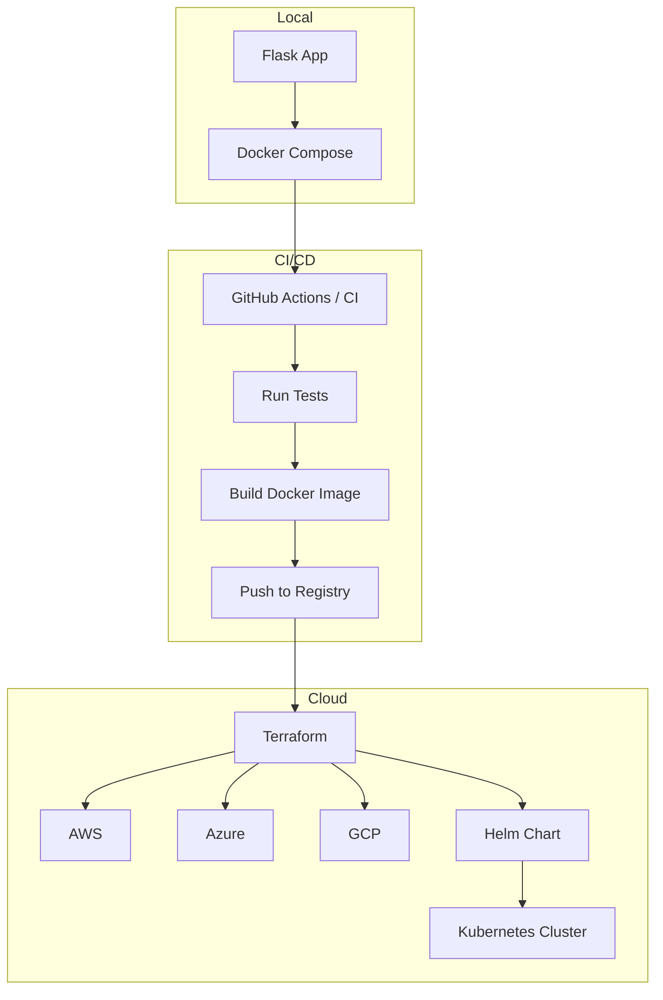

<

## Attention

⚠️ **Important:** This repository is actively maintained. Ensure you have the latest version of the scripts and Terraform modules. Follow the quick start guide to set up your environment. If you encounter any issues, please open an issue on GitHub.

## Table of Contents
- [Overview](#overview)
- [Purpose](#purpose)
- [Architecture](#architecture)
- [Components](#components)
- [Prerequisites](#prerequisites)
- [Installation](#installation)
- [Configuration](#configuration)
- [Usage](#usage)
  - [Run Locally](#run-locally)
  - [CI/CD Pipelines](#cicd-pipelines)
  - [Deploy to Cloud Providers](#deploy-to-cloud-providers)
- [Quick Start](#quick-start)
- [Testing](#testing)
- [Contributing](#contributing)
- [License](#license)

## Overview
This repository provides a **multi‑cloud CI/CD pipeline** that automates the build, test, and deployment of applications to AWS, Azure, GCP, and Kubernetes environments.

## Purpose
The goal is to simplify multi‑cloud deployments by offering reusable Terraform modules, Helm charts, Docker configurations, and end‑to‑end scripts that can be easily integrated into existing CI/CD workflows.

## Architecture
The following diagram illustrates the high‑level architecture of the pipeline, showing how the local development environment, CI/CD processes, and cloud deployments interact.



## Components
Below is a brief description of each top‑level component in the repository.

### `app/`
- **Purpose**: Local development of the sample Flask application.
- **Key Files**:
  - [`app/app.py`](app/app.py) – Flask entry point.
  - [`app/Dockerfile`](app/Dockerfile) – Container definition.
  - [`app/docker-compose.yml`](app/docker-compose.yml) – Compose file for local services.
- **Usage**: Run with Docker Compose or directly via Python.

### `deploy/`
- **Purpose**: Cloud‑specific deployment scripts.
- **Key Files**:
  - [`deploy/aws/app.py`](deploy/aws/app.py) – AWS deployment helper.
  - Additional scripts for Azure and GCP under their respective directories.

### `helm/`
- **Purpose**: Helm chart for deploying the Flask app to Kubernetes.
- **Key Files**:
  - [`helm/Chart.yaml`](helm/Chart.yaml) – Chart metadata.
  - [`helm/values.yaml`](helm/values.yaml) – Default values.
  - Templates in [`helm/templates/`](helm/templates/) – Kubernetes manifests.

### `terraform/`
- **Purpose**: Terraform root configuration and reusable modules for each cloud provider.
- **Key Files**:
  - [`terraform/main.tf`](terraform/main.tf) – Root module.
  - Modules under [`terraform/modules/`](terraform/modules/) – Provider‑specific resources (AWS, Azure, GCP, IAM, Secrets).
  - Policy files in [`terraform/policies/`](terraform/policies/) – Sentinel policies for compliance.

### `scripts/`
- **Purpose**: Helper scripts to build, test, and deploy the pipeline.
- **Key Scripts**:
  - [`scripts/build.sh`](scripts/build.sh) – Build Docker images.
  - [`scripts/cicd_pipeline.sh`](scripts/cicd_pipeline.sh) – Orchestrates CI/CD locally.
  - Cloud‑specific deployment scripts (`deploy_aws.sh`, `deploy_azure.sh`, `deploy_gcp.sh`).

## Prerequisites
- Docker (>= 20.10)
- Docker Compose (>= 2.0)
- Python 3.9+
- Terraform 1.5+
- Git
- (Optional) Kubernetes cluster access (kubectl configured) for Helm deployments

## Installation
1. **Clone the repository**
   ```sh
   git clone https://github.com/your-org/multi-cloud-cicd-pipeline.git
   cd multi-cloud-cicd-pipeline
   ```
2. **Set up the Python virtual environment**
   ```sh
   python -m venv .venv
   .venv\Scripts\activate   # Windows
   # or source .venv/bin/activate   # Unix
   pip install -r app/requirements.txt
   ```

3. **Initialize Terraform**
   ```sh
   terraform init
   ```

4. **(Optional) Install pre‑commit hooks**
   ```sh
   pre-commit install
   ```

## Configuration
Copy the example environment file and adjust values for your deployment:
   ```sh
   cp .env.example .env
   # Edit .env as needed (e.g., cloud credentials, Docker registry, etc.)
   ```

## Usage
### Run Locally
Start the Flask application and its dependencies with Docker Compose:
   ```sh
   docker compose -f app/docker-compose.yml up --build
   ```
You can then access the app at `http://localhost:5000`.

### CI/CD Pipelines
The repository includes scripts to execute the full CI/CD flow locally:
   ```sh
   ./scripts/cicd_pipeline_local.sh
   ```
These scripts run linting, unit tests, build Docker images, push them to a registry, and apply Terraform plans.

### Deploy to Cloud Providers
#### AWS
   ```sh
   ./scripts/deploy_aws.sh
   ```
#### Azure
   ```sh
   ./scripts/deploy_azure.sh
   ```
#### GCP
   ```sh
   ./scripts/deploy_gcp.sh
   ```
Each script uses the corresponding Terraform module and Helm chart to provision resources and deploy the application.

## Quick Start
For a fast end‑to‑end experience, run the following one‑liner:
   ```sh
   git clone https://github.com/your-org/multi-cloud-cicd-pipeline.git && cd multi-cloud-cicd-pipeline && cp .env.example .env && python -m venv .venv && .venv\Scripts\activate && pip install -r app/requirements.txt && terraform init && docker compose -f app/docker-compose.yml up --build
   ```

## Testing
Run the Python test suite with pytest:
   ```sh
   pytest ./app/tests
   ```

## Visual References
### Application UI


### Terraform Plan Example


### Helm Release Overview


## Contributing
Contributions are welcome! Please read the [CONTRIBUTING guidelines](CONTRIBUTING.md) before submitting a pull request.

## License
This project is licensed under the MIT License – see the [LICENSE](LICENSE) file for details.
]]>